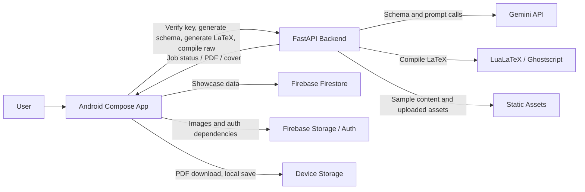

# MagBoy / MagazineForge

MagBoy is an AI-assisted magazine creation platform that combines a native Android app, a FastAPI backend, LuaLaTeX template compilation, and cloud-hosted services to turn a topic and a chosen design direction into a polished magazine-style PDF.

The project has grown in phases rather than as a single finished scaffold. What exists now is a working product loop with several connected surfaces:
- an Android Compose app for onboarding, browsing, editing, co-authoring, viewing, and library management
- a FastAPI backend that can verify a Gemini key, generate magazine schemas, turn schemas into LaTeX, compile raw LaTeX into PDF jobs, and serve sample assets
- a template system with multiple cover/article/TOC layouts and generated preview samples
- Firebase-backed community and storage features
- a CI pipeline for Android builds and validation

This document is the repo-wide reference for what the project is, how it is structured, what is already implemented, what is still incomplete, and what is currently not fully verified.

## Current Status

The project is beyond prototype stage, but it is not fully finished.

Implemented and working in the codebase:
- Android navigation shell with Compose screens for Home, Studio, Gallery, Library, and Settings
- Gemini key onboarding and verification flow
- Backend endpoints for schema generation, LaTeX generation, raw LaTeX generation, and PDF compilation jobs
- Template gallery with 18 templates across six categories
- In-app PDF viewing and local PDF persistence on the device
- Community showcase feed backed by Firestore
- Asset generation scripts that produce sample PDFs and thumbnails
- Mock-compile test paths for backend validation
- GitHub Actions workflow for Android CI

Partially implemented or still dependent on external configuration:
- Hugging Face deployment URL and authentication headers
- Firebase project wiring and data availability
- Live sample URL verification for static assets
- Local-device PDF library population depends on successful compile/download flow
- Some image upload flows and storage-backed publishing are still more of a product decision than a fully locked-down final implementation

Not fully solved or explicitly not complete:
- backend job persistence is in-memory and ephemeral
- static sample URLs were noted as pending live verification in the architecture docs
- the docs disagree in a few places on visual design canon, so the canonical UI language should be treated as the one currently used by the Android code unless intentionally updated

## Product Vision

The intended product is a mobile-first magazine creation tool for people who want a premium editorial result without needing design software.

The intended user flow is:
1. Open the Android app.
2. Enter or verify a Gemini API key.
3. Pick a magazine template or start from the studio.
4. Give the app a topic, style direction, and supporting material.
5. Let Gemini produce a structured magazine schema or raw LaTeX.
6. Compile that content through the backend using LuaLaTeX.
7. View the final PDF in-app and keep it in the local library.
8. Optionally publish or browse community examples through the showcase feed.

The intended product outcome is not just "generate a PDF". It is to produce editorial-grade magazine layouts with a premium dark visual identity, structured AI-assisted composition, and a usable mobile authoring flow.

## What We Have Built So Far

### 1. Android App

The Android app is a single-activity Jetpack Compose app. Top-level navigation is controlled from `MainActivity.kt`, which switches between screens rather than using a large fragment stack.

The current navigation labels in code are:
- Home
- Studio
- Gallery
- Library
- Settings

The app also has special full-screen flows for:
- onboarding / key verification
- PDF viewing
- compile success and compile error states

#### Implemented screens

- `OnboardingScreen.kt`
  - first-run entry point when no saved API key exists
  - verifies the key locally or through the backend
  - stores the key securely after a successful verification

- `ShowcaseScreen.kt`
  - community feed / gallery of published magazines
  - reads items from Firestore through `ShowcaseRepository.kt`
  - opens magazine PDFs when selected

- `TemplateGalleryScreen.kt`
  - shows template cards and category filters
  - lets the user select a template and start in the editor
  - can preview sample PDFs and template thumbnails

- `EditorScreen.kt`
  - studio-style authoring surface
  - starts from a topic and template
  - integrates with the ViewModel compile and schema flows
  - is the main entry point for the magazine creation workflow

- `CoAuthorScreen.kt`
  - fine-grained magazine editing and assisted page construction
  - supports structured page fields and richer editorial control
  - is used after schema generation succeeds

- `LatexNotebookScreen.kt`
  - raw LaTeX notebook/editor path
  - intended for advanced manual editing and direct code-level control

- `MyMagazinesScreen.kt`
  - reads PDFs from local app storage
  - lists saved magazines with date and size metadata
  - opens a selected PDF in the viewer

- `SettingsScreen.kt`
  - app preferences and configuration surface
  - supports the broader product shell

- `PdfViewerScreen.kt`
  - in-app PDF display
  - used for both server-generated PDFs and local files

- `AuthScreen.kt`
  - Firebase auth-related surface present in the codebase
  - part of the wider account/community feature set

#### Android app architecture

The app uses:
- Compose UI with Material 3
- a shared `EditorViewModel` for schema, LaTeX, raw LaTeX, and compile state
- secure local key storage in `SecureStorage`
- Retrofit for backend calls
- Firebase Firestore for showcase content
- Firebase Storage and Firebase Auth dependencies for cloud-backed features
- Coil for image loading
- Jetpack Security for encrypted shared preferences

The app also defines a distinct editorial theme style:
- deep dark backgrounds
- warm gold/copper accents
- serif headers with sans-serif body text
- a premium publishing-desk look rather than a generic app theme

### 2. Backend

The backend is a FastAPI service running as the cloud compilation and generation engine.

It is responsible for:
- verifying Gemini API keys
- generating structured magazine schemas from prompts
- generating LaTeX from a schema and template variant
- generating raw LuaLaTeX from a user prompt
- compiling raw LaTeX into PDFs
- serving job status, PDF downloads, and cover extraction
- serving sample assets under `/static`
- handling temporary uploaded assets under `/assets`

#### Main backend flow

The key workflow in `backend/main.py` is:
1. accept a request from the Android app or test harness
2. optionally normalize image URLs or uploaded image paths
3. generate a magazine schema or raw LaTeX
4. write a working `.tex` file into a per-job workspace
5. compile the document with LuaLaTeX, unless running in mock mode
6. run Ghostscript to extract a cover image
7. store the job result in memory
8. let the client poll `/job/{id}/status`
9. let the client fetch the final PDF or cover image

#### Backend endpoints

- `GET /`
  - root health check
  - returns a small status object

- `GET /health`
  - health check endpoint
  - used by clients and tests

- `POST /verify-key`
  - checks whether a Gemini API key is valid enough for the app to continue
  - accepts both old-style and newer key formats

- `POST /generate-schema`
  - generates a structured magazine schema from a topic and template variant
  - uses Gemini when not in mock mode
  - returns a default mock schema when `MOCK_COMPILE=True` or a mock-like key is detected

- `POST /generate-latex`
  - converts a schema into a full LaTeX document
  - injects cover, TOC, and article templates
  - sanitizes text before insertion into LaTeX

- `POST /generate-raw-latex`
  - asks Gemini for raw LuaLaTeX directly from a prompt
  - intended for advanced or experimental flows

- `POST /compile-raw`
  - queues a background compilation job
  - returns a `jobId` immediately

- `GET /job/{job_id}/status`
  - reports compile progress and job state

- `GET /job/{job_id}/download`
  - downloads the generated PDF if the job completed successfully

- `GET /job/{job_id}/cover`
  - returns the extracted cover image

- `POST /upload-asset`
  - stores a file temporarily in the backend assets directory
  - returns a relative URL to the uploaded asset

#### Compile pipeline details

The backend compile path is more than a single subprocess call.

It currently performs these steps:
- creates a job workspace directory under `backend/workspace/<job_id>`
- writes the incoming LaTeX into `magazine.tex`
- scans for image URLs in `\includegraphics{...}` and tries to download/convert them locally
- normalizes Google Drive image links into downloadable links when possible
- runs LuaLaTeX twice in production mode so references and TOC/page data can settle correctly
- falls back to mock PDF generation when `MOCK_COMPILE=True`
- extracts a JPEG cover image from page 1 using Ghostscript
- stores the PDF path and status in `JOBS`

Important operational note:
- `JOBS` is an in-memory dictionary, so compile history disappears if the backend restarts
- this is acceptable for short-lived demo/testing flows, but it is not durable job storage

### 3. Templates and assets

The project uses a template-driven publishing system rather than a single hardcoded magazine format.

Backend template files live under `backend/templates/` and include:
- `cover_template_a.tex`
- `cover_template_b.tex`
- `cover_template_c.tex`
- article template variants
- TOC template variants

The template system is supported by sample generation scripts that produce:
- sample PDFs
- preview thumbnails
- static URLs for gallery display

The main supporting script is `backend/generate_assets.py`, which regenerates sample content and rewrites template metadata. This is important because the template gallery only feels real if the thumbnails and sample PDFs are kept in sync.

### 4. CI and automation

The repo includes GitHub Actions for Android CI.

The current CI story is:
- Android builds are run in GitHub Actions rather than relying on local Android Studio builds alone
- the workflow is designed to handle Firebase-related config assumptions more safely in CI
- release and debug build behavior is separated through the Android Gradle configuration

Supporting utilities in the repository include:
- `generate_icons.py` for launcher assets
- `create_space.py` for Hugging Face Space creation
- `check_space.py` for Hugging Face Space status checks
- `patch_templates.py` for updating template metadata and sample references
- `backend/test_compile_raw.py` for compilation smoke testing
- `backend/test_e2e.py` for backend end-to-end validation in mock mode

## Detailed Architecture

### High-level system architecture



### Backend responsibility map

- `main.py`
  - request routing
  - CORS
  - background job execution
  - compile orchestration
  - static asset serving

- `gemini_service.py`
  - Gemini prompt construction and response shaping
  - schema generation support

- `schemas.py`
  - request and response models
  - magazine schema model types

- `Dockerfile`
  - container build instructions for Hugging Face Spaces
  - system packages needed for TeX and image processing

- `packages.txt`
  - OS-level dependencies

- `requirements.txt`
  - Python package dependencies

### Android responsibility map

- `MainActivity.kt`
  - top-level state machine and navigation shell
  - screen switching
  - PDF viewer transitions
  - compile-state coordination

- `EditorViewModel.kt`
  - schema generation state
  - LaTeX generation state
  - compile job polling
  - PDF download and local persistence
  - showcase publishing after a successful compile

- `ApiClient.kt` and `ApiService.kt`
  - network configuration
  - authentication header injection
  - backend endpoint definitions

- `ShowcaseRepository.kt`
  - Firestore read/write for public showcase content

- `SecureStorage.kt`
  - encrypted storage of the user’s Gemini key

## Repository Structure

```text
MagBoy/
├── android-app/
│   └── app/
│       ├── build.gradle.kts
│       └── src/main/java/com/magazineforge/app/
│           ├── MainActivity.kt
│           ├── network/
│           ├── models/
│           ├── ui/
│           └── utils/
├── backend/
│   ├── main.py
│   ├── gemini_service.py
│   ├── schemas.py
│   ├── Dockerfile
│   ├── packages.txt
│   ├── requirements.txt
│   ├── templates/
│   └── static/
├── .github/workflows/
├── architecture.md
├── DESIGN.md
├── MagazineApp_MasterBlueprint_v3.md
├── TEST_INFRA.md
├── TEST_READY.md
├── generate_icons.py
├── create_space.py
├── check_space.py
├── patch_templates.py
└── magazine-analysis/
```

## Implemented Features

### Foundation and onboarding

- Gemini API key entry and verification
- secure API key persistence
- first-run routing based on whether a saved key exists
- premium dark visual style with editorial typography

### Studio and generation flow

- prompt-driven magazine generation from the Studio screen
- schema generation through the backend
- schema-to-LaTeX conversion
- raw LaTeX generation path for advanced use
- asynchronous compilation jobs
- compile progress polling
- PDF download and PDF viewing

### Template gallery and previews

- 18 template definitions
- six template categories
- preview cards with thumbnails
- sample PDF preview access
- template selection into the editor flow

### Co-authoring and deeper editing

- structured editing flow for page-level magazine construction
- richer per-page and per-field control than the basic prompt-only path
- image field support in the backend pipeline

### Showcase and social browsing

- Firestore-backed public showcase feed
- publishing a magazine into the showcase collection after successful compile
- opening a shared magazine PDF from the feed

### Library and local storage

- locally persisted PDFs under the app files directory
- library view with file name, size, and date metadata
- in-app open of saved magazines

### Backend tooling and verification

- mock compile mode for tests
- raw compile smoke tests
- end-to-end backend validation
- live compile pipeline for real PDF output
- temporary asset upload and cleanup

## What Is Still Missing or Needs More Work

This is the part that should stay explicit in the README so nobody mistakes “partially built” for “finished.”

### Planned or not fully closed

- A final, fully documented end-to-end sync story for how every generated PDF is surfaced in the local library and how that should behave on all devices
- A final production decision on which image source path is canonical for every editing flow
- A fully confirmed Firebase storage/auth strategy for all upload and publication paths
- A verified live set of Hugging Face static sample URLs after token rotation
- A single canonical UI/design source of truth if the docs and the current Compose implementation drift apart again

### Known gaps in the current codebase

- `JOBS` is ephemeral because it lives only in memory
- compile state can be lost on backend restart
- docs mention some planned Firebase Storage behavior that is not fully enforced by the code yet
- the design docs are not perfectly aligned with each other
- some cloud-dependent flows cannot be considered verified until the live endpoints and tokens are confirmed again

### Behaviors that should not be oversold

- do not describe compile jobs as durable background tasks
- do not describe asset URLs as fully verified if they still depend on a live deployment check
- do not describe the showcase as a complete social network; it is a Firestore-backed public feed
- do not describe the library as synchronized with every upstream source unless that flow is tested end to end

## Design System

The current visual language is a premium editorial one:
- deep obsidian / matte dark backgrounds
- gold and copper accents
- serif headers
- clean sans-serif body text
- a magazine desk / luxury publishing feel rather than a stock Material app

Current design references in the repo:
- `DESIGN.md`
- `android-app/app/DESIGN.md`
- theme files under `android-app/app/src/main/java/com/magazineforge/app/ui/theme/`

If the docs conflict, the code should be treated as the immediate source of truth and the README should call out the mismatch rather than pretending it does not exist.

## External Services and Secrets

### Hugging Face Spaces

Used for:
- backend hosting
- PDF generation
- template/sample asset serving
- compile job endpoints

### Gemini API

Used for:
- API key validation
- magazine schema generation
- raw LaTeX generation

### Firebase

Used for:
- Firestore showcase storage
- Firebase Auth dependencies
- Firebase Storage dependencies for media workflows

### Android local secrets

Used for:
- Hugging Face access token in `local.properties`
- secure local API key storage on device

## Setup and Development Notes

This section is intentionally high level because the repo already contains several build/test entry points, and the exact commands can vary depending on whether you are running mock mode, local backend mode, or the live Hugging Face deployment.

### Android

- The app is configured as a modern Android application with Compose and Java 17
- release signing is configured in the app Gradle file
- Firebase dependencies are included in the Android build
- the Hugging Face token is loaded from `local.properties` into `BuildConfig.HF_TOKEN`

### Backend

- the backend is a Docker-friendly FastAPI app
- it expects TeX and Ghostscript dependencies in the runtime image
- `MOCK_COMPILE=True` enables a test-friendly path that avoids live LaTeX compilation
- the backend serves both static assets and generated job outputs

### Verification

Useful validation surfaces in the repo include:
- `backend/test_compile_raw.py`
- `backend/test_e2e.py`
- `backend/verify_template.py`
- Android CI workflow under `.github/workflows/android-ci.yml`
- compile and generation logs in the backend workspace during runtime

## Git History and Project Evolution

The git history shows a phased build rather than a one-shot app:
- the repo began as an initial MagazineForge scaffold
- the first major shift was a full Compose UI redesign around a premium editorial theme
- later commits added backend generation, template systems, preview assets, and a richer editor/co-author flow
- Firebase integrations expanded the app into a public showcase and storage-backed product
- recent work focused on secrets handling, image handling, API reliability, and compile correctness

That history matters because the project is not just a static app shell. It is a product that has moved from concept into a multi-surface authoring and publishing system.

## Suggested Reading Order for Contributors

1. Read this README first.
2. Open [architecture.md](architecture.md).
3. Review [backend/README.md](backend/README.md) for the backend-only API summary.
4. Read [MagazineApp_MasterBlueprint_v3.md](MagazineApp_MasterBlueprint_v3.md) for the long-form product vision and roadmap.
5. Use the Android and backend source files for implementation details.

## Final Summary

MagBoy is an AI magazine builder with a real codebase, not a stub.

What exists now is:
- a native Android app
- a cloud FastAPI backend
- a template-driven LuaLaTeX rendering pipeline
- a local PDF library
- a community showcase feed
- generated template assets and test scaffolding

What still needs attention is:
- durable backend job handling
- tighter canonical documentation for the design system
- fully verified cloud deployment details
- any feature that is still described as planned in the code or docs rather than fully complete

This README should stay honest about those boundaries so future work starts from reality instead of assumptions.
