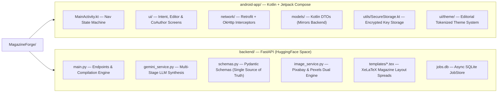
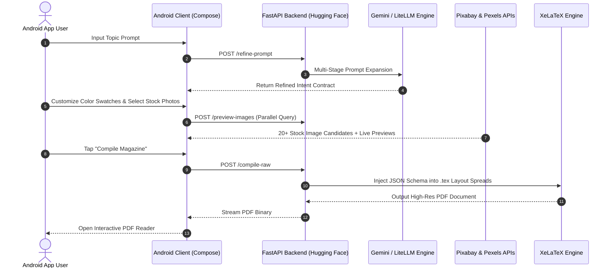

# 📖 MagazineForge


> **MagazineForge** is an enterprise-grade, AI-native magazine publishing platform built for Android and Python. It combines multi-stage LLM intent expansion, dynamic layout compilation, dual-provider stock photo aggregation, and high-precision LaTeX typesetting to transform single prompts into luxury, print-ready 16-page magazine PDFs.

---

## 🌟 Premium Features

*   **📱 Native Jetpack Compose UX:** Built with a custom luxury dark/gold editorial design system (`LuxeTypography`, tokenized styling, glassmorphism, and reactive state management).
*   **✨ In-Place Prompt Refinement:** Instant LLM prompt expansion right on the Intent Card screen without losing context or resetting user input.
*   **🎨 Interactive Color Swatch Selector:** 7 curated luxury color swatches (Pure White, Classic Gold, Crimson Red, Electric Cyan, Royal Purple, Warm Amber, Dark Charcoal) with real-time accent hex binding.
*   **🔍 Dual-Provider Image Aggregation:** Searches Pixabay (12 results) and Pexels (10 results) in parallel, delivering 20+ candidate stock photos with live image thumbnail previews inside the schema editor.
*   **📰 High-Fashion Table of Contents:** Vogue/GQ-style structured TOC spread with double-digit page badges (`01`, `02`), section rules, and column layout synthesis.
*   **🏷️ 4th Custom Title Selection:** Choose from 3 AI-suggested titles or type in your own custom magazine title with direct schema binding.
*   **☁️ Serverless TeX Document Compiler:** Offloads complex PDF generation to a Hugging Face Space running XeLaTeX and Ghostscript for instant, high-res PDF downloads.

---

## 🛠 Architectural Overview



---

## ⚡ System Data Flow & Pipeline



---

## 🔒 Security & Data Model Synchronization

1. **Strict Data Contract Sync**: `backend/schemas.py` is the single source of truth. All Pydantic schema updates are mirrored field-for-field in Kotlin DTOs (`MagazineSchema.kt`).
2. **Encrypted Key Storage**: User API keys are stored on-device using Android `EncryptedSharedPreferences` (`SecureStorage.kt`).
3. **Isolated Header Authentication**: The backend utilizes custom `X-LiteLLM-Url` and `X-LiteLLM-Key` headers alongside Hugging Face Bearer tokens.

---

## 🚀 Local Development Setup

### Backend
```bash
cd backend
pip install -r requirements.txt
uvicorn main:app --reload --port 7860
```
*(Requires `xelatex` and `ghostscript` installed on your path for PDF compilation)*

### Android App
1. Add your Hugging Face bearer token to `android-app/local.properties`: `HF_TOKEN=hf_...`
2. Open `android-app/` in Android Studio.
3. Sync Gradle and run on device or emulator.

---

*MagazineForge: Where editorial design meets artificial intelligence.*
