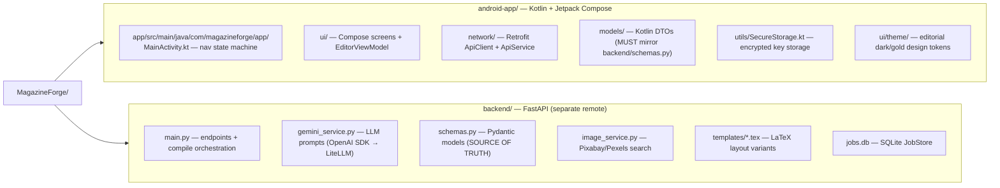
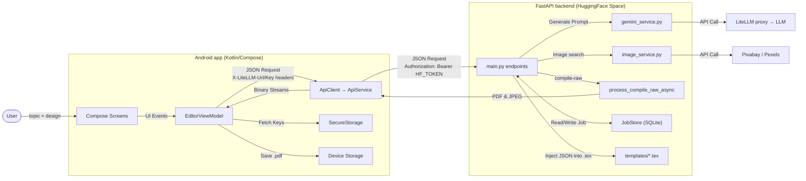

# 📖 MagazineForge


> **MagazineForge** (internally known as *MagBoy*) is a complete, cloud-compiled AI publishing platform that lives in your pocket. It orchestrates a sophisticated multi-stage AI pipeline to transform your simple prompts and device images into beautifully structured, production-ready magazine PDFs.

---

## ✨ Key Features

*   **📱 Native & Polished:** Built natively with Kotlin and Jetpack Compose. Features a custom dark/gold editorial design system, perfectly synced custom splash screens, buttery-smooth navigation, and elegant micro-animations.
*   **🧠 Intelligent Orchestration:** The app securely passes your LiteLLM credentials to a distributed backend, which orchestrates structured JSON data extraction from LLMs to author compelling articles, mastheads, and pull quotes.
*   **☁️ Cloud-Compiled PDFs:** Offloads heavy document processing to a HuggingFace Space. Native LaTeX (LuaLaTeX) and Ghostscript compile high-resolution, multi-page PDFs in seconds.
*   **🚀 Ultra-Fast Asset Streaming:** Bypasses mobile CPU bottlenecks by streaming raw image bytes directly to the server. Server-side Pillow processes high-res 2400px covers and article images in milliseconds.
*   **💾 Robust Persistence:** Features on-device encrypted `SecureStorage` for API keys and UI themes, a persistent SQLite `JobStore` for background tasks, and seamless local PDF management.

---

## 🛠 Developer & Architecture Guide

> **🤖 AI Agent Context:**
> - **Primary objective**: Generate high-quality magazine PDFs from user prompts using LiteLLM and LuaLaTeX.
> - **Single Source of Truth**: `backend/schemas.py`. Any schema changes here MUST be immediately mirrored in the Kotlin DTOs (`android-app/.../models/`).
> - **Design System**: Strict dark/gold editorial theme. Read `DESIGN.md` before changing any UI.
> - **Testing & Dev**: Set `MOCK_COMPILE=True` when running the backend locally to bypass expensive LLM/LaTeX calls.

### 1. Repository Layout



### 2. System Architecture & Data Flow



### 3. Critical Authentication Detail
The backend runs on a **private** Hugging Face Space. The Android `ApiClient` globally injects `Authorization: Bearer <HF_TOKEN>` via an OkHttp interceptor. 
User LLM credentials are provided **per-call** via custom `X-LiteLLM-Url` and `X-LiteLLM-Key` headers. **Never** mix LiteLLM credentials into the Authorization header, or the HF gateway will reject the request.

### 4. The Data Model Sync Rule
`backend/schemas.py` is the **single source of truth**. The Kotlin DTOs in `android-app/.../models/` must mirror it field-for-field. If you rename a field in `schemas.py`, update the Kotlin file in the same commit to avoid `422 Unprocessable Entity` crashes.

---

## 🚀 Build & Run Instructions

**Backend (Local Testing)**
```bash
cd backend
pip install -r requirements.txt
uvicorn main:app --reload --port 7860     # Set MOCK_COMPILE=True to skip LaTeX
```
*(Requires `lualatex` and `gs` on your PATH for real PDF compilation).*

**Android App**
1. Create `android-app/local.properties` and add your HuggingFace token: `HF_TOKEN=hf_...`
2. Open `android-app/` in Android Studio.
3. Sync Gradle and hit Run.

---
*MagazineForge: Where editorial design meets artificial intelligence.*
