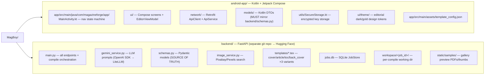
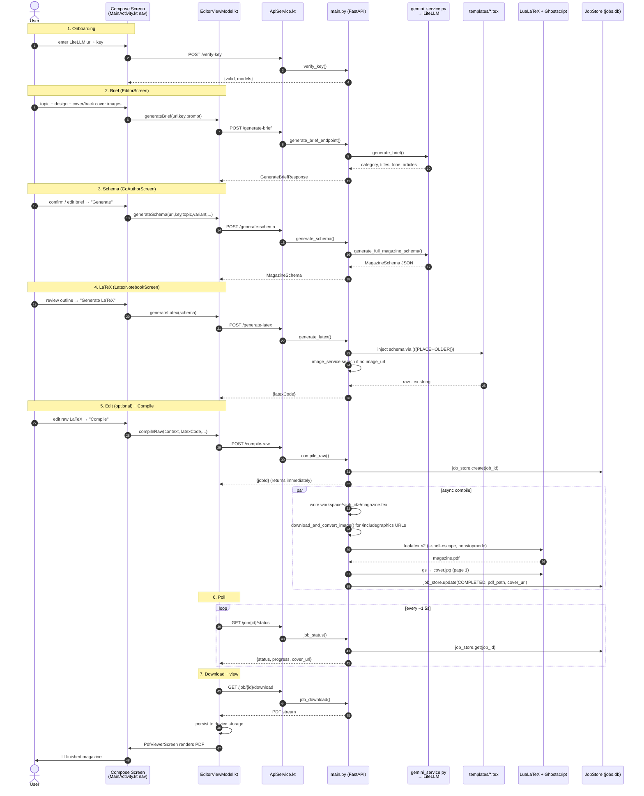
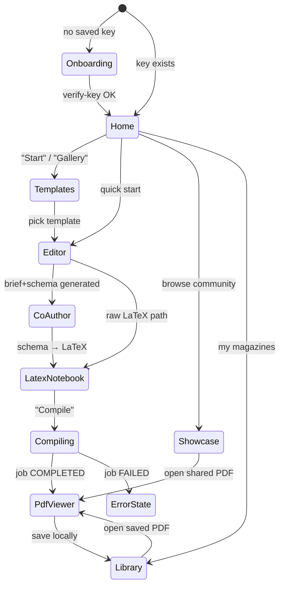
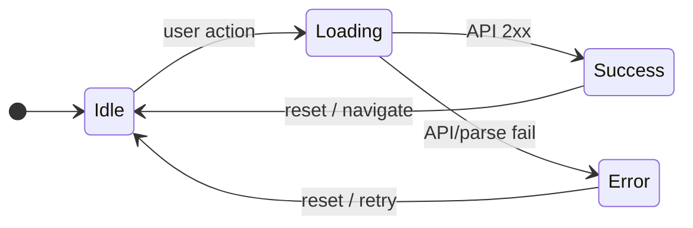
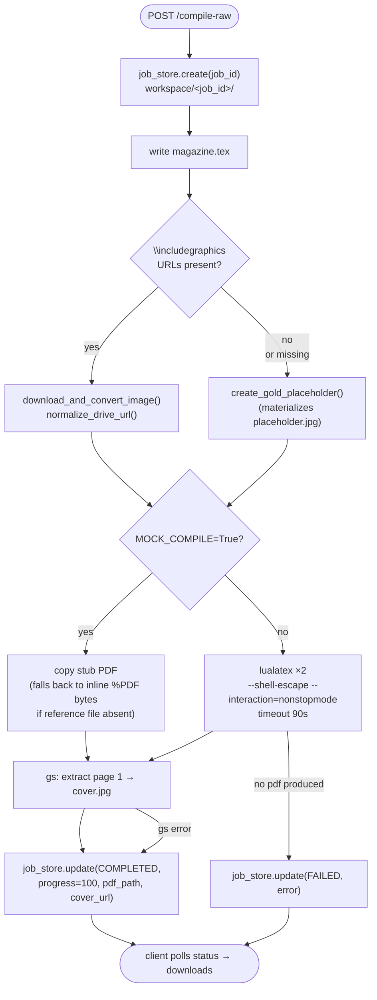
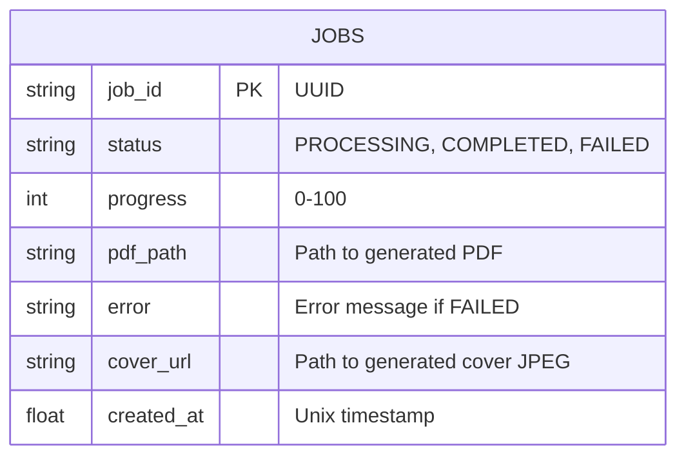
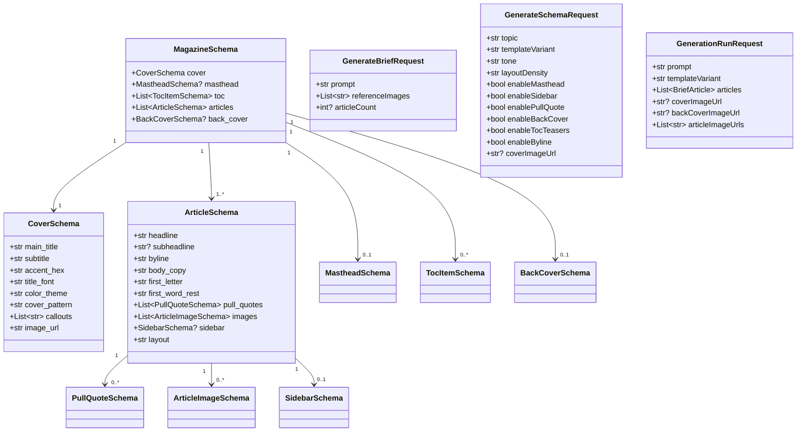

# MagBoy / MagazineForge

> **Read this first.** It is the canonical map of the *current* codebase.

> **🤖 AI Agent Context:**
> - **Primary objective**: MagBoy generates high-quality magazine PDFs from user prompts using LiteLLM and LuaLaTeX.
> - **Single Source of Truth**: `backend/schemas.py`. Any schema changes here MUST be immediately mirrored in the Kotlin DTOs (`android-app/.../models/`).
> - **Design System**: Strict dark/gold editorial theme. Read `DESIGN.md` before changing any UI.
> - **Testing & Dev**: Set `MOCK_COMPILE=True` when running the backend locally to bypass expensive LLM/LaTeX calls and return stub data quickly.

MagBoy is an AI-assisted magazine builder. A user (in the Android app) gives a
topic + design direction; a FastAPI backend uses an LLM (via a LiteLLM proxy)
to author a structured schema, fills `.tex` templates, compiles them with
LuaLaTeX, and returns a PDF that the app views and stores locally.

```
Android (Kotlin/Compose)  ──HTTPS──▶  FastAPI backend (Hugging Face Space)
                                            │
                                            ├─▶ LiteLLM proxy ──▶ LLM (schema / brief / raw LaTeX)
                                            ├─▶ LuaLaTeX + Ghostscript (compile → PDF + cover)
                                            ├─▶ Pixabay/Pexels (image search fallback)
                                            └─▶ SQLite JobStore (jobs.db) — persists across restarts
```

---

## 1. Repository layout (where to look)



### File quick-reference

| You want to… | Open this |
|---|---|
| Add/change a backend endpoint | `backend/main.py` (route) + `backend/schemas.py` (models) |
| Change LLM prompts / response parsing | `backend/gemini_service.py` |
| Change a request/response shape | `backend/schemas.py` **and** `android-app/.../models/*.kt` (keep in sync!) |
| Add an Android screen | `android-app/.../ui/YourScreen.kt` + register route in `MainActivity.kt` |
| Change app business logic | `android-app/.../ui/EditorViewModel.kt` |
| Change the compile pipeline | `backend/main.py` → `process_compile_raw_async()` |
| Edit a magazine layout | `backend/templates/*.tex` (uses `(((PLACEHOLDER)))` syntax) |
| Change colors/typography | `android-app/.../ui/theme/` + `DESIGN.md` |

---

## 2. System architecture & data flow

```mermaid
flowchart LR
    USER([User])

    subgraph APP["Android app (Kotlin/Compose)"]
        UI["Compose Screens<br/>Editor / CoAuthor / LatexNotebook / PdfViewer"]
        VM["EditorViewModel<br/>(StateFlows + network calls)"]
        NET["ApiClient → ApiService<br/>(Retrofit + HF bearer interceptor)"]
        SEC["SecureStorage<br/>(encrypted LiteLLM url+key)"]
        STORE["device storage<br/>(saved PDFs)"]
    end

    subgraph BACK["FastAPI backend  (Hugging Face Space)"]
        ROUTER["main.py endpoints"]
        GS["gemini_service.py"]
        IS["image_service.py"]
        COMPILE["process_compile_raw_async<br/>LuaLaTeX × Ghostscript"]
        JOBS["JobStore (SQLite jobs.db)"]
        TEMPL["templates/*.tex"]
        WS["workspace/&lt;job_id&gt;/"]
    end

    LLM["LiteLLM proxy → LLM"]
    IMGAPI["Pixabay / Pexels"]
    FB["Firebase<br/>(Firestore showcase / Storage / Auth)"]

    USER -->|topic + design| UI
    UI -->|UI Events| VM
    VM -->|Fetch Keys| SEC
    VM -->|"JSON Request<br/>X-LiteLLM-Url/Key headers"| NET
    NET -->|"JSON Request<br/>Authorization: Bearer HF_TOKEN"| ROUTER

    ROUTER -->|Generate Prompt| GS
    ROUTER -->|Image search (articles & covers)| IS
    ROUTER -->|compile-raw (Job ID)| COMPILE
    ROUTER <-->|Read/Write Job Status| JOBS
    ROUTER -->|"Inject JSON into .tex<br/>(((PLACEHOLDERS)))"| TEMPL
    COMPILE -->|Write .tex, run lualatex| WS
    COMPILE -.->|"MOCK_COMPILE=True<br/>(Skip LLM & LaTeX)"| WS

    GS -->|API Call| LLM
    IS -->|API Call| IMGAPI
    COMPILE -->|PDF & JPEG outputs| NET
    NET -->|Binary Streams| VM
    VM -->|Save .pdf| STORE
    UI -.->|Showcase feed| FB
```

### Critical auth detail (do not break this)
The backend is a **private** Hugging Face Space. The Android `ApiClient` injects
`Authorization: Bearer <HF_TOKEN>` **globally** via an OkHttp interceptor. The
user's LiteLLM credentials are therefore passed **per-call** via separate headers:
`X-LiteLLM-Url` and `X-LiteLLM-Key`. Never move LiteLLM creds into `Authorization`
or the HF gate will reject/overwrite them.

---

## 3. The end-to-end magazine pipeline

This is the main product flow. Each step names the exact file/function responsible.



---

## 4. Android navigation & ViewModel state

Navigation is **not** a fragment stack — it's a string-keyed `currentScreen`
state in `MainActivity.kt`. Routes: `onboarding`, `home`, `editor`,
`templates`, `gallery`, `co_author`, `latex_notebook`, `library`, `showcase`,
plus full-screen `pdf_viewer` / compile `success` / `error` states.



### EditorViewModel state machine
`EditorViewModel.kt` exposes four `StateFlow`s that drive the UI. Each is a
sealed class with `Idle / Loading / Success / Error`:

| StateFlow | Sealed type | Pushed by | Consumed by |
|---|---|---|---|
| `briefState` | `BriefState` | `generateBrief()` | EditorScreen |
| `schemaState` | `SchemaState` | `generateSchema()` | CoAuthorScreen |
| `latexState` | `LatexState` | `generateLatex()` | LatexNotebookScreen |
| `compileState` | `CompileState` | `compileRaw()` → poll loop | PdfViewer / success / error |



---

## 5. Backend endpoint reference (current)

All in `backend/main.py`. LiteLLM-protected routes read `X-LiteLLM-Url` /
`X-LiteLLM-Key` via `get_api_keys(request)`.

| Method | Path | Purpose | LLM? |
|---|---|---|---|
| GET | `/`, `/health` | health check | — |
| POST | `/verify-key` | validate LiteLLM url+key (lists models) | read |
| POST | `/generate-brief` | topic → category/titles/tone/article list | ✓ |
| POST | `/generate-schema` | topic+variant → full `MagazineSchema` | ✓ |
| POST | `/generate-latex` | schema → filled `.tex` string (no LLM) | — |
| POST | `/generate-raw-latex` | prompt → raw LuaLaTeX | ✓ |
| POST | `/rewrite-selection` | AI rewrite of selected text | ✓ |
| POST | `/render-page` | render a single page | — |
| POST | `/compile-raw` | queue LuaLaTeX job → `{jobId}` | — |
| GET | `/job/{id}/status` | poll job (`COMPLETED`/`PROCESSING`/`FAILED`) | — |
| GET | `/job/{id}/download` | stream PDF | — |
| GET | `/job/{id}/cover` | stream cover JPEG | — |
| POST | `/upload-asset` | temp image upload | — |

---

## 6. Compile pipeline internals (`process_compile_raw_async`)



**JobStore SQLite Schema (jobs.db):**


**Persistence note:** `JobStore` (in `main.py`, ~line 96) is backed by
`jobs.db` (SQLite). Jobs **survive backend restarts** — this is one of the
things the legacy docs wrongly claim is missing. `cleanup_old()` caps the store
at 15 jobs and trims matching workspace dirs on startup.

---

## 7. Data model — schema sync is load-bearing

`backend/schemas.py` is the **single source of truth**. The Kotlin DTOs in
`android-app/.../models/` must mirror it field-for-field or you get `422
Unprocessable Entity` / deserialization crashes.



**Rule:** if you add/rename a field in `schemas.py`, update the matching
Kotlin file in `models/` **in the same change**.

---

## 8. External services & config

| Service | Used for | Config location |
|---|---|---|
| Hugging Face Space | hosts backend (private) | `ApiClient.BASE_URL`; HF token in `android-app/local.properties` → `BuildConfig.HF_TOKEN` |
| LiteLLM proxy | LLM gateway (replaces direct Gemini) | user enters url+key at onboarding → `SecureStorage`; sent per-call as `X-LiteLLM-*` headers |
| Pixabay / Pexels | image search fallback | `backend/.env` → `PIXABAY_API_KEY`, `PEXELS_API_KEY` |
| Firebase | Firestore showcase feed; Storage/Auth deps | `android-app/app/google-services.json` (gitignored) |
| LuaLaTeX + Ghostscript | PDF compile + cover extraction | runtime binaries on the HF Space (`Dockerfile`, `packages.txt`) |

**Env flags**
- `MOCK_COMPILE=True` (backend) — skips LLM *and* LuaLaTeX, returns fast stub data + stub PDF. Used by tests and UI dev.

---

## 9. Build & run

**Backend (local)**
```bash
cd backend
pip install -r requirements.txt
uvicorn main:app --reload --port 7860     # MOCK_COMPILE=True to skip LaTeX
```
Requires `lualatex` and `gs` on PATH for real compiles.

**Android**
1. Create `android-app/local.properties` with `HF_TOKEN=hf_...`
2. Open `android-app/` in Android Studio, sync Gradle, run.

**Tests**
- `backend/test_e2e.py` — end-to-end in mock mode
- `backend/test_compile_raw.py` — compile smoke test
- `.github/workflows/android-ci.yml` — Android CI

---

## 10. Known gotchas

1. **Header collision.** HF bearer is injected globally; LiteLLM creds must
   stay in `X-LiteLLM-*` per-call headers.
2. **Schema sync.** `schemas.py` ↔ `models/*.kt` must match or requests 422.
3. **Template syntax.** `.tex` templates use `(((PLACEHOLDER)))`, not Jinja or
   standard LaTeX macros.
4. **Image auth.** Coil `AsyncImage` and PDF download need the HF
   `Authorization` header attached explicitly or the private space returns 401.
5. **`generate_cover_template_a_rendered.tex`** is a generated artifact in
   `backend/templates/`, not a source template.
6. **Backend is a separate git repo** (remote: Hugging Face). The root repo
   tracks it as a gitlink/submodule-like entry, not its contents.
